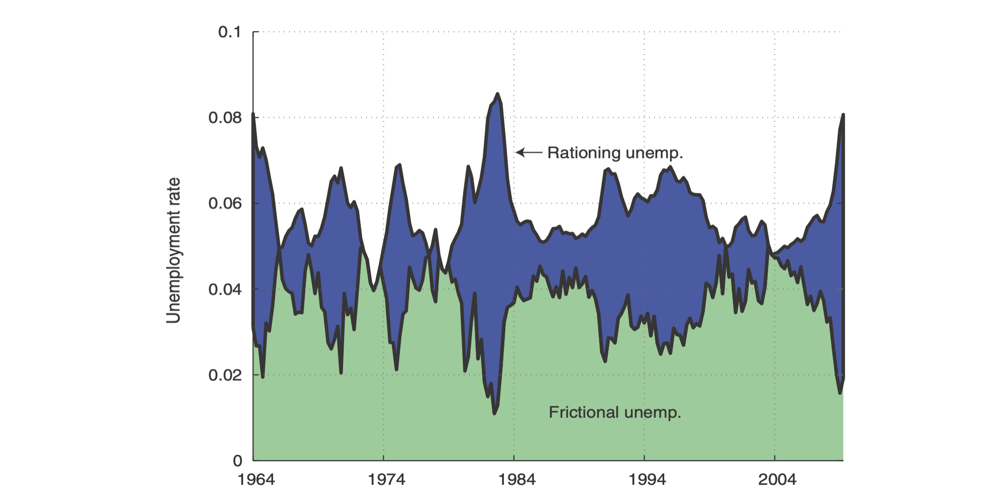

---

<!-- ##### Download

+ [Paper](paper1.pdf) -->
<!-- + [Online appendix](appendix1.pdf) -->
<!-- + [Code and data](https://github.com/pmichaillat/job-rationing) -->

---

##### Abstract

The Last to Enter Service (LES) delay announcement is one of the most commonly used delay announcements in queueing theory because it is quite simple to implement. Recent research has shown that using a convex combination of LES and the conditional mean delay are optimal under the mean squared error and the optimal value depends on the correlation between LES and the virtual waiting time. To this end, we show using simulation that it is important to be careful when using finite queue sizes, especially in a heavy traffic setting. Using simulation we demonstrate that the correlation between LES and the virtual waiting time can differ from heavy traffic results and can therefore have a large impact on the optimal announcement. Finally, we use simulation to assess the value of giving future information in computing correlations with virtual waiting times and show that future information is helpful in some settings.

---

<!-- ##### Figure X: Figure caption



---

##### Citation

Author. Year. "Title." *Journal* Volume (Issue): First page–Last page. https://doi.org/paper_doi.

```BibTeX
@article{AAYY,
author = {Author},
doi = {paper_doi},
journal = {Journal},
number = {Issue},
pages = {XXX--YYY},
title ={Title},
volume = {Volume},
year = {Year}}
```

--- -->

<!-- ##### Related material

+ [Presentation slides](presentation1.pdf)
+ [Dissertation title](https://escholarship.org/uc/item/7jr3m96r) – PhD dissertation on which this paper is based.
+ [Column title](https://cep.lse.ac.uk/pubs/download/cp365.pdf) – Nontechnical column describing the paper. -->

